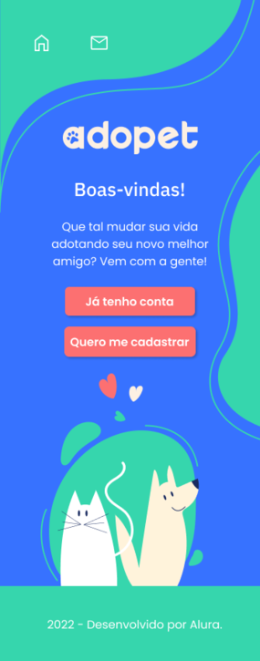
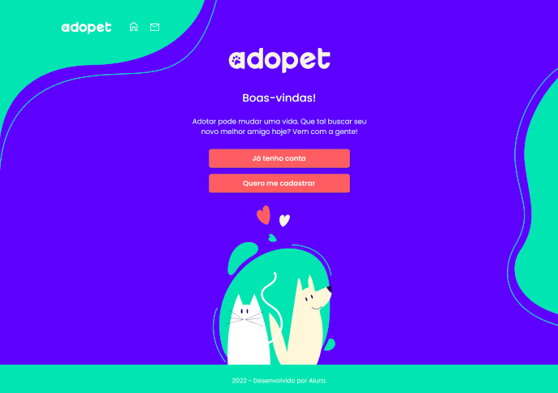

# ADOPET | ALURA CHALLENGE FRONT-END ED. 4

This is a solution to the [Alura Challenge Front-end 4ª edição](https://www.alura.com.br/challenges/front-end-4?host=https://cursos.alura.com.br).

## Table of contents

- [Overview](#overview)
  - [The challenge](#the-challenge)
- [Screenshot](#screenshot)
  - [Mobile](#mobile)
  - [Desktop](#mobile)
- [My process](#my-process)
  - [Status](#status)
- [Author](#author)

## Overview

### The challenge

The company AdoPet aims to act as an intermediary between animal adopters and NGOs that focus on removing animals from the street. To bring in more users and increase interaction between potential adopters and representatives of this NGO, the company wants to implement a digital platform.

The challenge, then, is to create, from a figma model, the website that must contain the following requirements:
- A home page that will be the login page, containing the buttons "I already have an account" and "I want to register";
- A registration page that will have a form requesting the information: name, e-mail and password;
- A login page with an email and password form;
- A page that should appear after login with a list of dogs and cats. Each animal must show a photo, name, age, size, characteristics and region. For each animal there will be a contact button;
- An editing page for sending a message, with a form with fields for name, phone, animal's name and message;
- Allow editing the profile, where it will also be possible to include a photo of the user.

**It is very important that the site is responsive** to give customers the ease of shopping through mobile devices.

##Screenshot

### Mobile

  

### Desktop

  

## My Process
- Built using JavaScritp and json-server to create an API.

### Status
Finalized

### Links
Source code: https://github.com/nalutm/adopet;
Site:

### Autoria
- Linkedin - [Nayara Luiza Moraes](https://www.linkedin.com/in/nayara-luiza-moraes-9a9382b5/)

